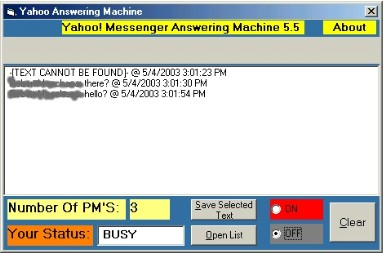



## yahoo messenger answering machine

### Description

ever leave yahoo messenger running and then come back to find out your flooded with 100's of messages? this app closes the windows for you and stores the mesages in a single listbox. Based on Spiyre get yahoo text module.
 
### More Info
 
yahoo messenger needs to be running

the messages that you recieve

             |
---                |---
**Submitted On**   |2003-05-04 19:39:10
**By**             |[fallentdh](https://github.com/Planet-Source-Code/PSCIndex/blob/master/ByAuthor/fallentdh.md)
**Level**          |Intermediate
**User Rating**    |4.0 (16 globes from 4 users)
**Compatibility**  |VB 6\.0
**Category**       |[Complete Applications](https://github.com/Planet-Source-Code/PSCIndex/blob/master/ByCategory/complete-applications__1-27.md)
**World**          |[Visual Basic](https://github.com/Planet-Source-Code/PSCIndex/blob/master/ByWorld/visual-basic.md)
**Archive File**   |[yahoo\_mess158363542003\.zip](https://github.com/Planet-Source-Code/fallentdh-yahoo-messenger-answering-machine__1-45261/archive/master.zip)

